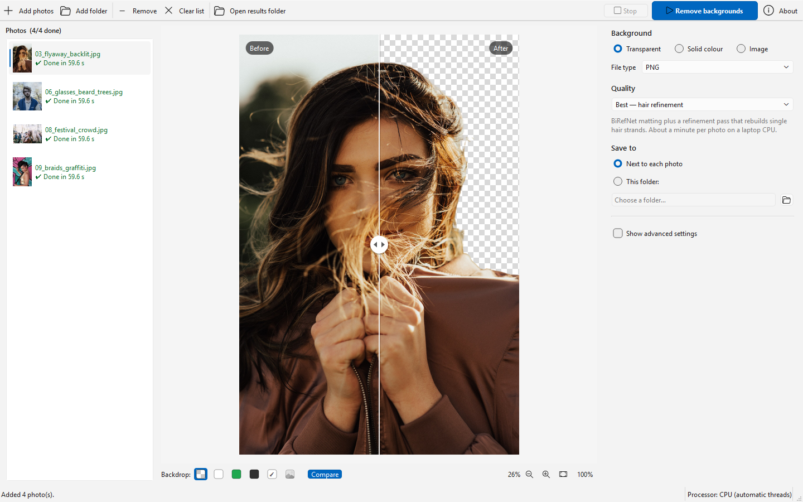

<!--
SPDX-FileCopyrightText: 2026 Optimey CommV
SPDX-License-Identifier: GPL-3.0-or-later
-->

# Background Editor

Windows desktop tool that removes the background from photos, built for portraits:
hair, loose strands, hats, beanies, headscarves and glasses stay with the person,
the real background goes. Put the person on a transparent background, a solid colour or
a picture of your own. Everything runs locally; photos are never uploaded.

Copyright (C) 2026 Optimey CommV. Free software under the GNU GPL version 3 or later
(see [Licence](#licence)). Formerly called Background Remover.



Why these AI models and settings: see [docs/MODEL-CHOICE.md](docs/MODEL-CHOICE.md), a
comparison of six models on ten deliberately hard portraits.

## Install

Download from the [Releases](../../releases) page: the installer, the portable zip and the
two source zips (see [Licence](#licence)).

Run `BackgroundEditor-Setup-<version>.exe`. It installs per user (no administrator rights)
into `%LOCALAPPDATA%\Programs\Background Editor`, adds a Start menu entry and, optionally,
**Remove background** to the right-click menu of JPEG, PNG, WebP, BMP, TIFF and HEIC photos
(on Windows 11 under *Show more options*). Selecting several photos and choosing it once
opens them all in one window. An installed *Background Remover* is removed first; its
downloaded models and settings are kept and moved over on the first start.

The app needs the **Microsoft Visual C++ Redistributable (x64), 14.51 or newer**. Most PCs
have it; if not, Setup offers to download Microsoft's installer
(<https://aka.ms/vc14/vc_redist.x64.exe>), which asks for administrator permission itself.

The AI models are downloaded once, when first needed, into
`%LOCALAPPDATA%\BackgroundEditor\models` and verified by SHA-256.

### Portable

Unzip `BackgroundEditor-<version>-portable.zip` anywhere (a USB stick works) and start
`BackgroundEditor.exe`. The file `portable.conf` next to the exe keeps the models
(`models\`), settings and logs (`data\`) inside the folder; delete it to use the per-user
folders instead. For a PC without internet, first choose *Download all models for offline
use* under *Show advanced settings* on a PC with internet, then copy the whole folder.
The portable folder needs the same Visual C++ Redistributable; see `README-portable.txt`.

## Use

1. Drop photos or a folder on the window (or *Add photos…*).
2. Choose the background: **Transparent**, **Solid colour** or **Image**. With *Image*,
   pick any picture of your own (JPEG, PNG, WebP, HEIC, …); choose how it fills the photo
   (cover, contain or stretch) and optionally blur it. Recently used images stay one click
   away.
3. Choose the quality and where to save, then click **Remove backgrounds**. Results are
   saved as `<name>_nobg.png` (JPEG is possible for a colour or image background). The app
   never overwrites a file it did not create: when a name is taken it picks
   `<name> (2)_nobg.png`.
4. Drag the slider in the preview to compare before and after; *100%* shows actual pixels.
   The backdrop buttons under the preview show the result on a grid, white, green (best for
   spotting leftover background colour), dark grey, your colour or your background image.

Right-click a photo in the list to open the result, show it in Explorer, or process it again.

| Preset   | What it does |
|----------|--------------|
| Best     | Person model plus a matting pass that rebuilds hair strands and soft edges |
| Balanced | Person model only |
| Fast     | Small general model; runs on a discrete GPU when one is available |

*Show advanced settings* holds the model choice, processor (automatic / GPU / CPU), hair
refinement, edge and mask controls, cropping, output options, updates and offline use.
Number fields and lists there only react to the mouse wheel once you click into them, so
scrolling through the settings never changes one by accident.

## Updates

**Check for updates** in the toolbar (also in *About* and under *Advanced settings ›
Updates*) looks for a new version of the app and for newer AI models, and shows one summary.

### New versions of the app

New versions are published as [GitHub Releases](https://github.com/Optimey-CommV/background-editor/releases).
Half a minute after the start, and at most once a day, the app asks GitHub for the latest
release (*Check for new versions at startup*, on by default). When there is a newer version,
a bar above the preview offers **Update now**, **What's new** (the release notes), **Skip this
version** and a close button; no answer, no release yet or no internet stays silent. Only the
small signed release manifest (see below) is downloaded to check a new version; nothing else
is downloaded or installed until you click *Update now*.

A newer release counts as an update only when it carries the **signed release manifest**
`BackgroundEditor-<version>-manifest.ps1` and that manifest passes every check below. GitHub's
own checksum is not enough, because GitHub computes it over whatever was uploaded. A release
without the manifest, or whose manifest or files fail a check, is **not a verified Optimey
release**: the app does not announce it at startup, never links to it, and *Check for updates*
says that it must not be installed. Its files cannot be told apart from a tampered release,
because the Optimey certificate authority is private and every other PC shows the genuine
installer as "Unknown publisher" too. The manifest is made and signed by `build.ps1`; it
lists the SHA-256 and size of the installer, of the portable zip and of every file inside that
zip. The app:

1. downloads the manifest first (a few kB), when it checks for a new version and again at
   *Update now*, and checks its Authenticode signature. The
   signer must be exactly the Optimey code signing certificate: its certificate authority is
   private, so other PCs do not trust the chain, and the app therefore pins the certificate
   itself by the SHA-256 of its DER encoding
   (`60F4CFB0C10D0D3247E29E460027F798981ED56A95BAA27F86779BF541C40C5A`; Windows shows it
   with the SHA-1 thumbprint `DC5A657A60F166815ACDA04E71581F7313553BEA`). Anything signed by
   another certificate is refused, even a trusted one. The certificate is read from
   `bgeditor/__init__.py` when the check runs;
2. reads the manifest as data only: the file must hold nothing but comment lines and one
   single-quoted here-string with JSON, and it is never run. Its version must be the
   release's version and newer than the running copy (never a downgrade), the size (and,
   when GitHub publishes one, the checksum) of this copy's download on GitHub must be the
   manifest's, and no file name may hold a `~` (it could be a Windows short name of another
   file). A genuine release that the running copy cannot install by itself (it is older than
   the manifest's *minimum version to update from*, or runs from source) points to the
   release page instead;
3. downloads the installer (installed copy) or the portable zip (portable copy) into the
   app's data folder, resuming an interrupted download, and requires its SHA-256 and size to
   be exactly the manifest's. When GitHub publishes a checksum as well, it must agree;
4. for the installer: checks its Authenticode signature too, and hashes it once more right
   before it starts it, while holding it open so that nothing can change it in between;
5. for the portable zip: unpacks it next to the app folder (into a folder only you,
   SYSTEM and Administrators may change, where the drive supports that) and checks that
   the unpacked files are exactly the manifest's files: none missing, none added, each with
   its SHA-256 and size. It checks this again right before it starts the update helper.

For any program file it checks, the app also refuses a signature block that holds more than
the signature itself: Authenticode does not cover that part of an .exe or .dll, so data
hidden there would otherwise pass as signed.

If photos are being processed, the app asks whether to update when they are done or to stop
them now. An installed copy then closes and runs the installer silently (with its progress
window); the installer starts the new version when it is done. A portable copy closes and a
small helper takes over. The helper and its settings are written into
`<app folder>.update-helper` next to the app folder, a folder only you, SYSTEM and
Administrators may change (where the drive supports that); the app keeps both files locked
until the helper has read them, and the helper uses its settings only when their SHA-256 is the
one the app passed on its command line. The helper checks the unpacked files against the
manifest once more, backs up the current program files into its own folder, copies the new
ones over them, hashing every file again as it copies it, starts the app again and removes its
folder. Its log is `data\updates\apply-update.log`. `models\`, `data\`, `portable.conf` and custom
model and data folders are never touched, also when they are junctions or links, and neither is
any other junction or link at the top of the app folder; nothing is written through a junction
or link, and a link inside a program folder is removed as a link, never followed. If anything
fails, the backup is put back. The portable folder and the folder around it must be writable.

If the update fails because the release or the download is not exactly what Optimey signed, the
app says so and does not suggest getting the version elsewhere. The release notes (*What's
new*) are not covered by the signature, so the app shows them inertly: raw HTML is shown as
text, images are replaced by their description and nothing is ever loaded from a file or
network address; a link opens only when it points into this repository on `github.com`.

To check an installer or manifest you downloaded yourself, run an installed copy with
`BackgroundEditor.exe --verify-update <file> --report check.txt` and read `check.txt`: it
must start with `ok:` and name the certificate SHA-256 above. Anything else must not be
installed. The portable zip itself is not signed: first check that version's
`BackgroundEditor-<version>-manifest.ps1` this way, then compare
`(Get-FileHash BackgroundEditor-<version>-portable.zip).Hash` with the `sha256` of the
`portable` entry in that manifest; they must be equal.

After a successful update, the app removes its own downloads of that version and older ones
from `data\updates` (about 20 seconds after the start): only files it downloaded itself and
recorded by name, size and SHA-256 in `data\updates\downloads.json`. Anything else in that
folder, such as the helper's log, stays.

### Replacing the signing key

The certificate the app trusts is fixed in each version (`SIGNER_CERT_SHA256` in
`bgeditor/__init__.py`). To retire the signing key, because it may have leaked or because the
certificate expires (September 2031):

1. Make a new code signing certificate and put the SHA-256 of its DER encoding in
   `SIGNER_CERT_SHA256`.
2. Build one hand-over release **signed with the old key**:
   `.\build.ps1 -CertSha256 <SHA-256 of the old certificate>` (the build warns that it signs
   with another certificate than the one it pins). Installed copies accept it because the old
   key signed it; from then on they trust only the new certificate. Leave it the latest
   release for a while, because the app only looks at the latest release.
3. Sign every later release with the new key (a normal `.\build.ps1`). A copy that never
   installed the hand-over release refuses those, because it still trusts only the old
   certificate: to it they are not verified Optimey releases, so it neither announces nor
   links to them. Tell its users some other way to install the new version by hand (and to
   check the installer with `--verify-update` of a copy that has the new certificate).

A release can also say that copies older than a given version must not install it
automatically (`.\build.ps1 -MinUpdateFrom x.y.z`, stored in the signed manifest), for
example when it needs another version in between. Such a copy does not install it by itself;
it names both versions and points to the release page, because the release itself is
verified.

If the old key has leaked, someone who can also publish on the GitHub repository could sign
updates with it for copies that still trust it; those copies are safe again once they have
installed the hand-over release, or a new version by hand. The app has no remote switch that
turns updates off, on purpose: such a switch would itself be something to attack.

### Model updates

The BiRefNet authors announced newer models. Once a week the app looks for them.
*Automatic* (the default) switches to a new model only when every safety check passes,
among them the publisher, a clear per-file licence, the checksum and a test run; otherwise
it tells you what it found and why it did not switch. *Ask first* never downloads without
asking; *Off* only checks when you click *Check for updates* or *Check now*. After a switch,
*Use <previous model> again* goes back; the previous model is never deleted.

## GPU

GPU acceleration uses Windows' own DirectML (`C:\Windows\System32\DirectML.dll`; Windows 11
24H2 or later is recommended). DirectML is used only where it was measured to give correct
results; a model that fails on a GPU in automatic mode moves to the CPU, and that is
remembered. Without a usable DirectML the app runs on the CPU.

## Build from source

```powershell
py -3.14 -m venv .venv
.venv\Scripts\python.exe -m pip install -r requirements.txt
.\build.ps1            # source zips, PyInstaller build, checks, self-test, signing, installer
```

`build.ps1 -NoSign` skips Authenticode signing (the app does not install such a build as an
update); `-NoInstaller` skips Inno Setup 6. The version comes from `bgeditor/__init__.py`;
`-Version x.y.z` overrides it for one build. `-MinUpdateFrom x.y.z` (default `1.1.0`) sets the
oldest version that may update to the build automatically. The build signs with the
certificate in `CurrentUser\My` whose SHA-256 is `SIGNER_CERT_SHA256` (`-CertSha256` only for
the hand-over release described above). The release manifest is made last, from the signed
installer and portable zip, signed, and then checked: PowerShell's own parser must see nothing
but the one here-string assignment, and the packaged app's own check (`BackgroundEditor.exe
--verify-update`) must accept the manifest and the installer.
The first build downloads the third-party source archives listed in
`tools\third_party_sources.json` (about 190 MB) into
`%LOCALAPPDATA%\BackgroundEditor-build-cache` and checks their SHA-256; later builds reuse
them. The build fails when DirectML.dll, a Visual C++ runtime DLL, Qt PDF, OpenCV or Intel
IPP ends up in the app folder, or when the licence files or the source zip are missing.
Results in `dist\`: the app folder, the installer, the portable zip, the release manifest,
the two source zips and `SHA256SUMS`.

Tests: `.venv\Scripts\python.exe tests\test_imaging.py`, `tests\test_engine.py`,
`tests\test_app_updates.py` and `tools\test_build_tools.py`. `test_app_updates.py` never signs
with the Optimey key: it signs its manifests and installers with a throwaway certificate that
exists only in memory for the length of the run (never in a certificate store) and pins that
one; the Optimey certificate is only used to verify the signed build in `dist\`.

Publishing a release: tag it `v<version>` (or `<version>`) with the version of
`bgeditor/__init__.py`, do not mark it as a pre-release (the app only looks at the latest full
release), and upload these files from `dist\` to the GitHub release with their build names:

- `BackgroundEditor-Setup-<version>.exe`
- `BackgroundEditor-<version>-portable.zip`
- `BackgroundEditor-<version>-manifest.ps1` (without it the app does not even announce the release)
- `BackgroundEditor-<version>-src.zip`
- `BackgroundEditor-<version>-third-party-sources.zip`
- `BackgroundEditor-<version>-SHA256SUMS.txt`

Run from source with `.venv\Scripts\python.exe app.py`. Do not install `rembg`, OpenCV or
numba into the build environment.

## Contributing

Issues and pull requests are welcome. Contributions are accepted under the same license as
the project. Before your first commit, run `pre-commit install`: the hooks check for secrets,
private IP addresses and missing license headers. Every file carries its copyright and
license in a header or in a `.license` file next to it ([REUSE](https://reuse.software/)).

## Security

Report vulnerabilities privately, as described in the
[security policy](https://github.com/Optimey-CommV/.github/blob/main/SECURITY.md).

## Licence

Background Editor is free software: you can redistribute it and/or modify it under the
terms of the GNU General Public License as published by the Free Software Foundation,
either version 3 of the License, or (at your option) any later version. It comes with
ABSOLUTELY NO WARRANTY. The full text is in `LICENSE`; `LICENSES.txt` lists every
third-party component and its licence (PyQt6 is GPL v3, Qt, libheif and libde265 are
LGPL v3, x265 is GPL v2 or later, Eigen inside ONNX Runtime is MPL 2.0, the GCC runtime
libraries are GPL v3 or later with the GCC Runtime Library Exception, the rest is
permissive). Because PyQt6 is GPL v3 only, the builds on the Releases page are conveyed
under the GNU GPL version 3.

- **Source code**: the program folder contains `source\BackgroundEditor-<version>-src.zip`,
  the complete source of that version. The sources of the GPL, LGPL and MPL third-party
  components are in `BackgroundEditor-<version>-third-party-sources.zip`, published next to
  the installer. When you give the installer or the portable zip to others, give both zips
  along.
- **Not included**: Microsoft's Visual C++ runtime and DirectML are used as Windows system
  components and are not distributed with the app.
- **AI models** are downloaded, not included. BiRefNet and ViTMatte are MIT licensed; their
  authors note that some training datasets carry research-only terms. BiRefNet v2 is
  announced as based on Meta's DINOv3, whose weights come under the DINOv3 License.
- **Test photo**: `assets/selftest_portrait.jpg` and `assets/selftest_reference.png` are
  derived from "Windblown (Unsplash).jpg" by Kaci Baum, Wikimedia Commons, CC0 1.0.
- **Screenshot**: `docs/screenshot.webp` shows photos by Kaci Baum, Seth Doyle, Michael Benz
  and giano currie, all CC0 1.0 via Wikimedia Commons (Unsplash).

Made by [Optimey](https://optimey.be).
